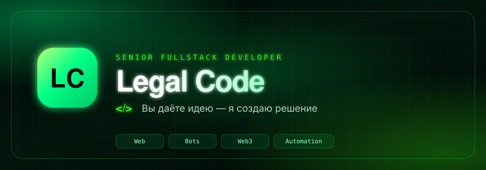

<div align="center">

  

  <br/><br/>

  <a href="https://t.me/LEGALXCODE">
    
  </a>
  &nbsp;
  <a href="https://t.me/LEGALCODEPRO">
    
  </a>
  &nbsp;
  <a href="https://github.com/LegalXCode">
    
  </a>

</div>

<br/>

```txt
┌─────────────────────────────────────────────────────────────┐
│  </ Legal Code >                                            │
│  Senior Fullstack Developer                                 │
│                                                             │
│  Вы даёте идею — я создаю решение.                          │
│  Продукты под любые задачи: от криптобирж                   │
│  до решений для министерства.                               │
└─────────────────────────────────────────────────────────────┘
```

---

## `⟨ / about ⟩`

Я создаю цифровые продукты, которыми пользуются тысячи.

- **Fullstack & Web** — лендинги, панели, сайты под ключ
- **Bots & Automation** — Telegram-боты, парсеры, чекеры
- **Casino & Web3** — казино, Solidity, крипто-интеграции

```js
const legalCode = {
  role: "Senior Fullstack Developer",
  focus: ["Web", "Bots", "Web3", "Automation"],
  status: "open_for_projects",
  contact: "t.me/LEGALXCODE",
  portfolio: "t.me/LEGALCODEPRO",
};
```

---

## `⟨ / stack ⟩`

<p align="center">
  
  
  
  
</p>

<p align="center">
  
  
  
  
</p>

<p align="center">
  
  
  
  
  
</p>

---

## `⟨ / metrics ⟩`

<div align="center">
  
  
</div>

<br/>

<div align="center">
  
</div>

---

## `⟨ / contact ⟩`

<div align="center">

  **Обсудим задачу, архитектуру и сроки**

  <br/>

  <a href="https://t.me/LEGALXCODE">
    
  </a>

  <br/><br/>

  

  <br/><br/>

  <sub>`</ Legal Code >` · code like it's evidence · ship like it's verdict</sub>

</div>
