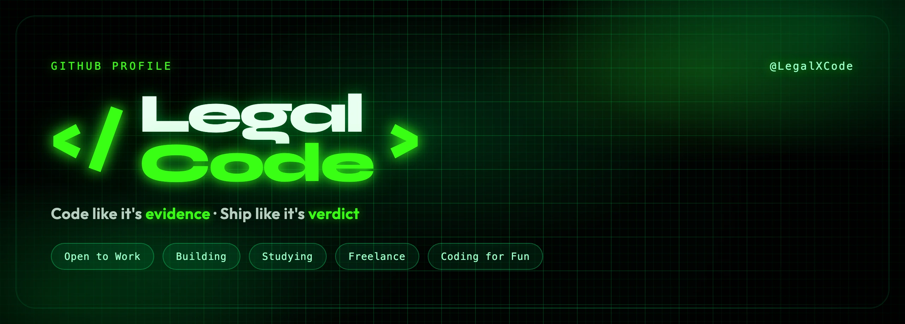

<!--
╔══════════════════════════════════════════════════════════╗
║  Legal Code · GitHub Profile                             ║
║  Neon grid · portfolio narrative                         ║
╚══════════════════════════════════════════════════════════╝
-->

<div align="center">
  
</div>

<br/>

<div align="center">
  
</div>

<br/>

---

## `⟨ / About ⟩`

<table width="100%">
<tr>
<td width="52%" valign="top">

```python
class LegalCode:
    """
    Full-Stack · Mobile · Security
    ML/AI · DevOps · Everything.
    """

    location    = "Wherever the Wi-Fi is strong"

    languages   = [
        "Python", "JS/TS", "Go",
        "Rust", "Swift", "Kotlin", "Java"
    ]

    domains     = [
        "Frontend",  "Backend",
        "Mobile",    "DevOps",
        "ML / AI",   "Security"
    ]

    status = {
        "freelance" : True,   # ← hire me
        "startup"   : True,   # ← stealth mode
        "learning"  : True,   # ← always
        "coding"    : True,   # ← for the love of it
    }

    mantra = (
        "Code like it's evidence. "
        "Ship like it's verdict."
    )

    def greet(self):
        return "Hey! Welcome to my profile"
```

</td>
<td width="48%" valign="top">

<br/>

🔭 &nbsp;**Currently building** — my own product (stealth)

🌱 &nbsp;**Always mastering** — something new every week

💼 &nbsp;**Available for** — freelance & interesting collabs

🧠 &nbsp;**Domains** — front to back, mobile to cloud, models to exploits

🎯 &nbsp;**Philosophy** — write code that matters, ship code that works

⚡ &nbsp;**Fun fact** — I've probably debugged more in my dreams than awake

☕ &nbsp;**Fuel** — `while(alive) { coffee++; }`

🔐 &nbsp;**Security mindset** — every line of code is a potential attack surface

<br/>

> *"Every system has a law. I write the ones that matter."*

<br/>

</td>
</tr>
</table>

---

## `⟨ / Tech Arsenal ⟩`

### Languages


---

### Frontend


---

### Backend


---

### Mobile


---

### DevOps & Cloud


---

### AI / ML


---

### Security


---

### Databases


---

## `⟨ / GitHub Metrics ⟩`

<div align="center">
  
  
</div>

<br/>

<div align="center">
  
</div>

<br/>

<div align="center">
  
</div>

---

## `⟨ / Currently Mastering ⟩`

<table width="100%">
<tr>
<td width="50%" valign="top">

**Rust — Systems Programming**
```
▓▓▓▓▓▓▓▓▓▓▓▓▓▓▓░░░░░  75%
```
Lifetimes, unsafe code, async runtimes

**LLM Engineering & RAG Pipelines**
```
▓▓▓▓▓▓▓▓▓▓▓▓░░░░░░░░  60%
```
Fine-tuning, agents, vector stores

**Exploit Development**
```
▓▓▓▓▓▓▓▓▓▓▓▓▓▓░░░░░░  70%
```
Memory corruption, shellcoding, ROP

</td>
<td width="50%" valign="top">

**Cloud Native Architecture**
```
▓▓▓▓▓▓▓▓▓▓▓▓▓▓▓▓░░░░  80%
```
Service meshes, observability, FinOps

**SwiftUI & iOS APIs**
```
▓▓▓▓▓▓▓▓▓▓░░░░░░░░░░  50%
```
Concurrency model, modern UI systems

**WebGPU & Real-Time Graphics**
```
▓▓▓▓▓▓▓▓░░░░░░░░░░░░  40%
```
Compute shaders, rendering pipelines

</td>
</tr>
</table>

---

## `⟨ / Featured Projects ⟩`

> Some projects are in stealth. Public repos live below.

<div align="center">

<a href="https://github.com/LegalXCode/Editing-yandex-direct-charts">
  
</a>
&nbsp;
<a href="https://github.com/LegalXCode/Fake-Loader">
  
</a>

</div>

---

## `⟨ / Connect ⟩`

<div align="center">

[](https://t.me/LegalXCode)
&nbsp;
[](https://t.me/LegalCodePro)
&nbsp;
[](https://x.com/LegalCode)
&nbsp;
[](https://github.com/LegalXCode)

<br/>


</div>

---

<div align="center">

<br/>

*Built with precision. Shipped with purpose.*

`// LegalCode · Code like it's evidence. Ship like it's verdict.`

</div>
